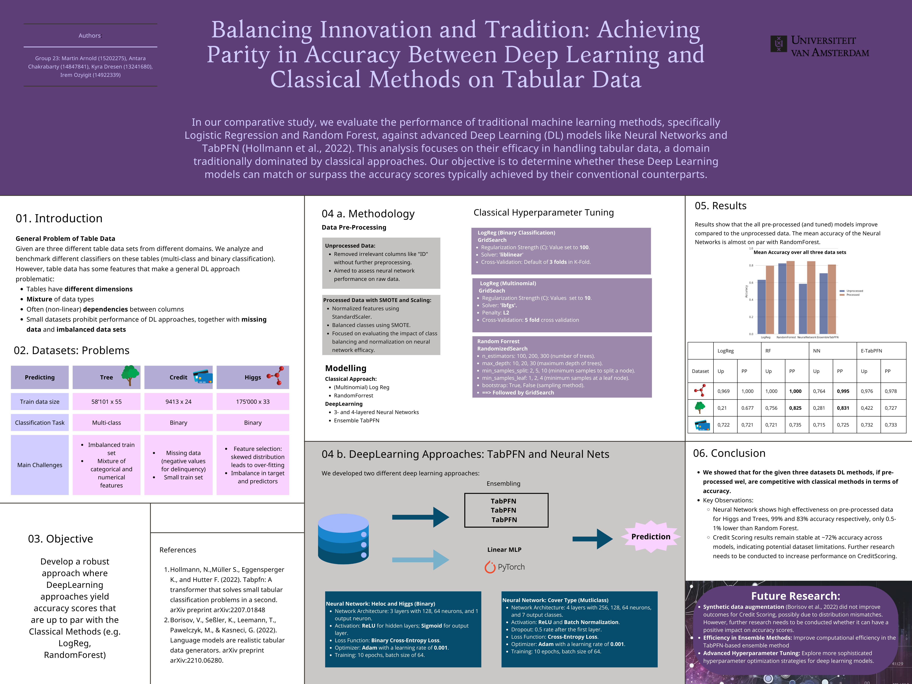

# Balancing Innovation and Tradition: Achieving Parity in Accuracy between Deep Learning and Classical Methods onTabular Data
## Final project, *Applied Machine Learning*, 2023, University of Amsterdam (UvA), Prof. Dr. Pascal Mettes

Authors: Kyra Dresen, Antara Chakrabarty, Martin Arnold

<a href="https://www.kaggle.com/competitions/benchmark-tabular-ml" target="_blank">Kaggle Competition</a>

