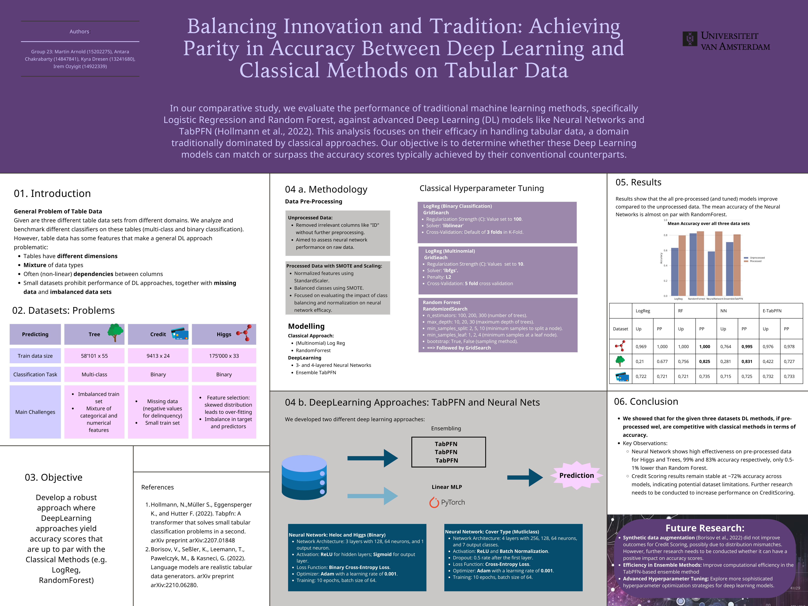

# Balancing Innovation and Tradition: Achieving Parity in Accuracy between Deep Learning and Classical Methods on Tabular Data
#### Final project, *Applied Machine Learning*, 2023, University of Amsterdam (UvA), Prof. Dr. Pascal Mettes

Authors: Kyra Dresen, Antara Chakrabarty, Martin Arnold

## Table of contents

- [Repository structure](#repository-structure)
- [Problem statement](#problem-statement)
- [Data](#data)

## Repository structure

- `./EDA` contains the Explanatory Data Analysis script
- `./data` contains the data
- `./submissions` contains the predictions submitted to the Kaggle competition
- `./scripts` contains the scripts used to get the predictions
- `./misc` contains the poster and other stuff for the repository

## Problem statement 
From the <a href="https://www.kaggle.com/competitions/benchmark-tabular-ml" target="_blank">Kaggle Competition</a>

#### Build a reliable and interpretable model for Tabular Datasets
With this project, your aim is to understand and build models for (subsets of) three real world tabular ML datasets: 
CoverType, HIGGS and HELOC.

The direction for the project is upto you, but take a look suggestions in the sections below. The key is to have your 
model(/s) perform well on the datasets and added bonus if they are interpretable as well!

#### Project Description
The key idea of this project is to evaluate and benchmark three tabular datasets with varying real world situations. 
There is a recent increase in interest on representation learning on tabular data in the research community with papers 
such as TabPFN, a pre-trained Transformer that can do supervised classification on tabular datasets in less than a second. 
This project can serve as an entry to anyone that is more interested in tabular representation learning.

We encourage you to evaluate different kind of tabular ML models from scikit-learn, tree-based models such as lightgbm, 
and TabPFN which can be an 'out-of-the-box' benchmarking. From there, you can dive deeper into developing an approach 
end-to-end where you can select the direction for this optimization yourself, e.g. using techniques taught in class, 
such as hyperparam optimization, regularization, etc. You are also encouraged to evaluate more recent and novel 
approaches using deep learning or synthetic data-augmentation (look at TapTap) wherever you see fit.

## Data
#### CoverType: Forest Cover Type Prediction
In this dataset, you are asked to predict the forest cover type (the predominant kind of tree cover) from strictly 
cartographic variables (as opposed to remotely sensed data). The actual forest cover type for a given 30 x 30 meter cell 
was determined from US Forest Service (USFS) Region 2 Resource Information System data. Independent variables were then 
derived from data obtained from the US Geological Survey and USFS. The data is in raw form (not scaled) and contains 
binary columns of data for qualitative independent variables such as wilderness areas and soil type.

This study area includes four wilderness areas located in the Roosevelt National Forest of northern Colorado. These 
areas represent forests with minimal human-caused disturbances, so that existing forest cover types are more a result of 
ecological processes rather than forest management practices.

#### HELOC: Home Equity Line of Credit Dataset
The FICO HELOC dataset contains anonymized information about home equity line of credit (HELOC) applications made by 
real homeowners. A HELOC is a line of credit typically offered by a US bank as a percentage of home equity (the 
difference between the current market value of a home and the outstanding balance of all liens, e.g. mortgages). The 
customers in this dataset have requested a credit line in the range of USD 5,000 - 150,000.

The target variable in this dataset is a binary variable called RiskPerformance. The value “Bad” indicates that an 
applicant was 90 days past due or worse at least once over a period of 24 months from when the credit account was opened. 
The value “Good” indicates that they have made their payments without ever being more than 90 days overdue. This dataset 
can be used to train a machine learning model to predict whether the homeowner qualifies for a line of credit or not.

#### HIGGS Dataset
This is a classification problem to distinguish between a signal process which produces Higgs bosons and a background 
process which does not.